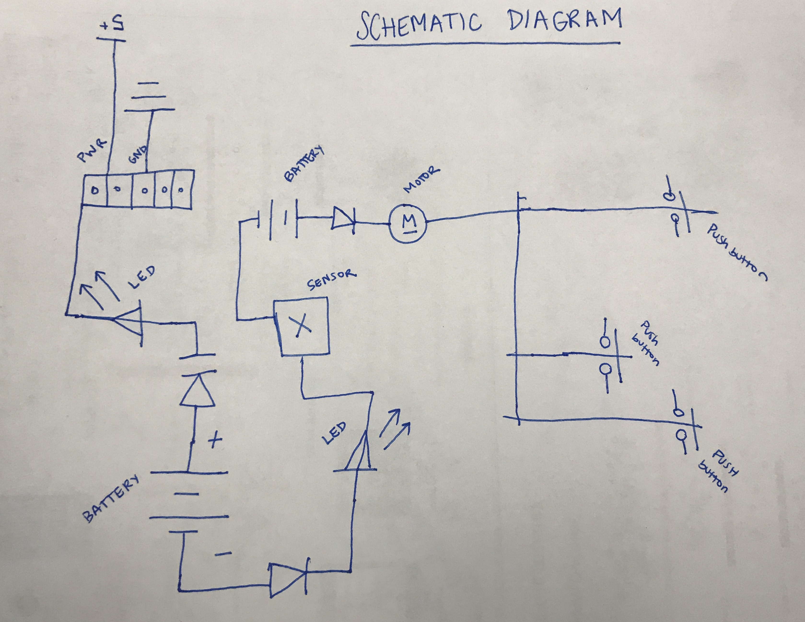

# IDD-Fa18-Lab1: Blink!

**A lab report by Natalie B. Abrams**

## Part A. Set Up a Breadboard


## Part B. Manually Blink a LED

**a. What color stripes are on a 100 Ohm resistor?**
 brown, black, black, red, red
**b. What do you have to do to light your LED?**
push the button and hold it! if you let go the LED turns off

## Part C. Blink a LED using Arduino

### 1. Blink the on-board LED

**a. What line(s) of code do you need to change to make the LED blink (like, at all)?**

digitalWrite()


**b. What line(s) of code do you need to change to change the rate of blinking?**

the delay() lines. the smaller the number the faster the blinking


**c. What circuit element would you want to add to protect the board and external LED?**

over voltage protector? short cuircut protector 
 
**d. At what delay can you no longer *perceive* the LED blinking? How can you prove to yourself that it is, in fact, still blinking?**

10/15. you can prove to yourself that it is still blinking because the light is on.


**e. Modify the code to make your LED blink your way. Save your new blink code to your lab 1 repository, with a link on the README.md.**

[My Blink](/my_blink.ino)

```arduino
void setup() {
  // initialize digital pin LED_BUILTIN as an output.
  pinMode(LED_BUILTIN, OUTPUT);
}

// the loop function runs over and over again forever
void loop() {
  digitalWrite(LED_BUILTIN, HIGH);   // turn the LED on (HIGH is the voltage level)
  delay(20);                       // wait for a second
  digitalWrite(LED_BUILTIN, LOW);    // turn the LED off by making the voltage LOW
  delay(100);                       // wait for a second
    digitalWrite(LED_BUILTIN, HIGH); 
  delay(40);                       
  digitalWrite(LED_BUILTIN, LOW);    
  delay(1000);                       
    digitalWrite(LED_BUILTIN, HIGH); 
  delay(30);                       
  digitalWrite(LED_BUILTIN, LOW);    
  delay(300);                   
    digitalWrite(LED_BUILTIN, HIGH);   
  delay(15);                       
  digitalWrite(LED_BUILTIN, LOW);    
  delay(15);                       
}
```


### 2. Blink your LED

**Make a video of your LED blinking, and add it to your lab submission.**

[Blink my LED](/blink_my_led.MOV)

[Blink your LED](/blink_your_led.MOV)

## Part D. Manually fade an LED

**a. Are you able to get the LED to glow the whole turning range of the potentiometer? Why or why not?**

yes I am able to get it to glow the whole turning range.

## Part E. Fade an LED using Arduino

**a. What do you have to modify to make the code control the circuit you've built on your breadboard?**

you need to set the variable 'led' to 11 so that it connects to my circut which is connected at pin 11.

**b. What is analogWrite()? How is that different than digitalWrite()?**

AnalogWrite() is a PWM (Pulse-Width Modulation), making it able to write an analog value through digital means. It is different than digitalWrite() because digitial write only writes a High or Low value and analog is able to create varying brightnesses (dimming).

[reference](https://www.arduino.cc/reference/en/language/functions/analog-io/analogwrite/)

[reference](https://www.arduino.cc/reference/en/language/functions/digital-io/digitalwrite/)

## Part F. FRANKENLIGHT!!!

### 1. Take apart your electronic device, and draw a schematic of what is inside.            


**a. Is there computation in your device? Where is it? What do you think is happening inside the "computer?"**

There is a processor chip that does the computations for the mouse. It is located at the bottom of the mouse. I think what is happenening is the chip computes its location relativly using the LED and sensor, so that when someone moves the mouse, the chip computes this action into a digital action on the screen.

**b. Are there sensors on your device? How do they work? How is the sensed information conveyed to other portions of the device?**

I would say the computation device is connected to the processor chip. The sensor is a mix of the LED and computing chip to sense when a user moves the mouse. The sensor detects relative movement and sends it to the chip which sends it through the wires to the computer it is plugged into via USB.

**c. How is the device powered? Is there any transformation or regulation of the power? How is that done? What voltages are used throughout the system?**

The device is powered by taking 5 volts from the computer to power it when you plug the mouse into your computer. Yes there is regulation of power. The power and ground wires that are connected to the board and flow through the USB. I am not sure if the computer or chip itself regulates power, but when I had the mouse plugged in and was playing around with it, I accidently shorted power to ground, and I immediatly got a notification on my computer that the USB port had been disabled for using too much power. 

**d. Is information stored in your device? Where? How?**

No, I do not think there is any information stored on my device. 

### 2. Using your schematic, figure out where a good point would be to hijack your device and implant an LED.

I played around a lot trying to understnd exactly what did what on the mouse board. There was already an LED on the device, so I was able to hold wires to the pins that held the LED, and connect them to my breadboard, putting one wire to power and the other to ground. I then had my breadboard plugged into my computer so that it could recieve power and pass it onto the mouse, which in turn lit up the LED.

I also took an external LED and taped it onto the power and ground on the board. When I plugged the mouse into my computer the LED lit up. 

### 3. Build your light!

**Make a video showing off your Frankenlight.**

***Add an LED***

[](https://youtu.be/EGgCspMCIh4)

***Hack the exsisting LED***

[](https://youtu.be/IuNmaIKVBm4)


**Include any schematics or photos in your lab write-up.**


